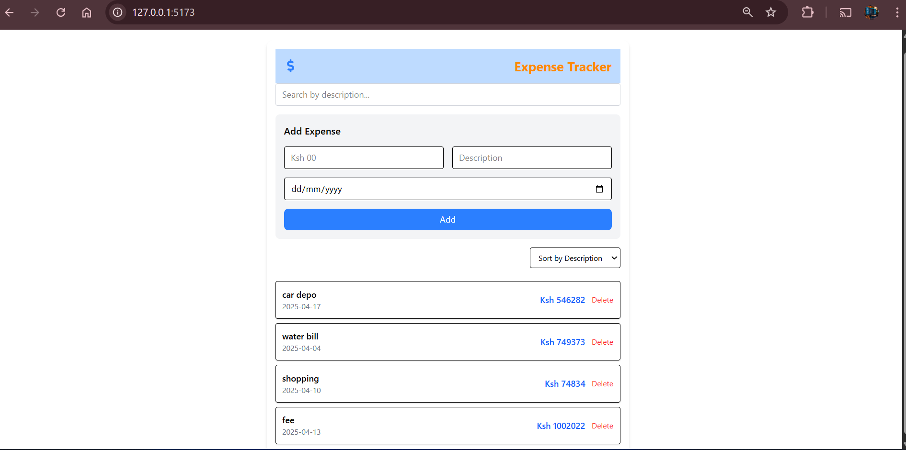

# 💸 Expense Tracker App

> A clean, interactive, and beginner-friendly **Expense Tracker** built with **React**, **TypeScript**, and **Tailwind CSS**.

This application allows users to easily **add**, **search**, **sort**, and **delete** expense entries. It is ideal for anyone learning React or managing simple personal finances. With a responsive design and modern styling, it's built for both desktop and mobile users.

---

## 📸 Screenshot
### 💻 Full View



> _To add your screenshots:_
> - Create a folder called `screenshots/` in the root.
> - Save your screenshots as `desktop-view.png`, `mobile-view.png`, etc.

---

## ✨ Features

### ✅ Core Features

- 📥 **Add New Expense**
  - Enter amount (Ksh), description, and date.
- 📝 **Expense List**
  - Displays all added expenses in a clean card layout.
- 🔍 **Live Search**
  - Filter expenses as you type by description.
- 📅 **Date Picker**
  - Easily select the date of an expense.

### 🌟 Advanced Features

- 🔡 **Sort Alphabetically**
  - Sort expenses by description (A–Z or Z–A).
- ❌ **Delete Individual Expense**
  - Remove any specific expense from the list.
- 🧾 **Responsive UI**
  - Fully responsive layout for desktop, tablet, and mobile.

---

## 🛠️ Technologies Used

| Technology     | Description                              |
|----------------|------------------------------------------|
| **React**      | Component-based UI library               |
| **TypeScript** | Strongly-typed superset of JavaScript   |
| **TailwindCSS**| Utility-first CSS framework              |
| **React Icons**| Icon library for React                   |

---

## 📂 Project Structure


---

## ⚙️ Getting Started

Follow these steps to run the project locally on your machine:

### 🔁 Clone the Repo

```bash
git clone https://github.com/yourusername/expense-tracker.git
cd expense-tracker


## Install Dependencies
   npm install

Run the App Locally
npm run dev
Open in browser: http://localhost:5173

🧪 Usage
Enter your expense amount in Kenyan Shillings (e.g., 250).

Add a short description (e.g., Lunch, Bus Fare, Grocery).

Pick a date for the expense.

Click Add to save the expense.

Use the search bar to filter by description.

Click the sort button to toggle alphabetical order.

Press ❌ on a listed expense to delete it.


🔮 Future Improvements
💾 Persist expenses in LocalStorage

📊 Add a Monthly Summary or Pie Chart

🗂 Group expenses by category

🔐 Add User Authentication

☁️ Sync to Firebase/Backend API